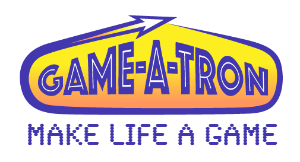
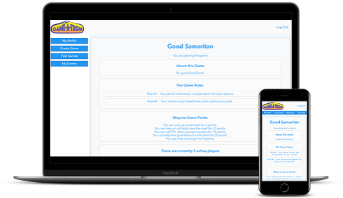

  

## About
  Game-A-Tron is a web application that helps people to gamify their lives. 

## Links
- [Client Repo](https://github.com/open-sourcerers-ei26/client)
- [Server Repo](https://github.com/open-sourcerers-ei26/server)
- [Deployed Client](https://ei26.netlify.com/)

## ScreenShots

  

## Development Stack
**Front End:**
  - React
  - Redux
  - CSS

**Back End:**
  - Express
  - Passport
  - MongoDB
  - Mongoose

**Testing:** 
  - Mocha
  - Chai
  - Enzyme

